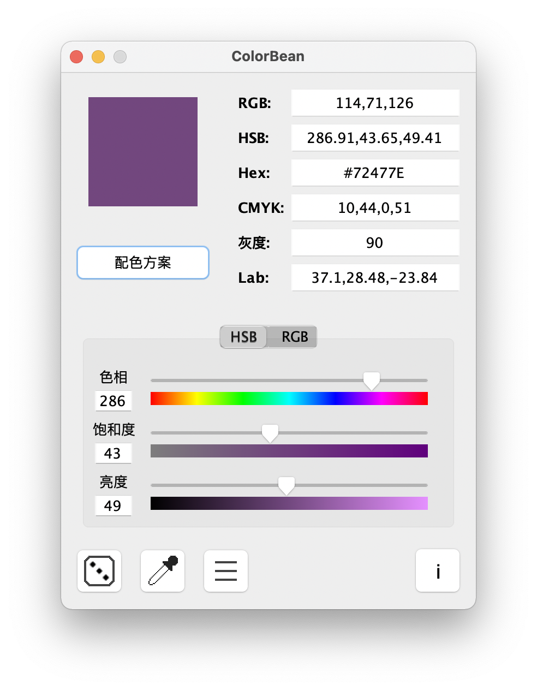

# ColorBean

A tool for Coloring, including calculating color formulas(schemes) and color model conversions

一个用于处理颜色的工具，包含计算配色方案和颜色模型转换



## About Project

此项目是 [ColorPad (Windows)](https://xyuxf.com/colorpad) 的分支。也是一个 ColorPad Console 的 GUI 开源版本的实现，使用
Java 开发。

This project is a branch of [ColorPad (Windows)](https://xyuxf.com/colorpad). As well as an open source GUI edition
implementation of the ColorPad Console. Developed in java.

### Relative Project

> [ColorPadConsole](https://github.com/Snowlt/ColorPadConsole) - A tool for calculating color formulas(schemes) and
> color
> model conversions

*ColorBean 已继承 ColorPad Console 全部的功能*

> [FitINI](https://github.com/bekaX/FitINI) - A simple library of INI files

### Others

IDE: `IntelliJ IDEA` Runtime: Java 1.8+

Open source license: BSD 3

## 开发环境启动 / Dev Environment Run

在 **Java 9 及以上版本**，启动程序时需要向 Java(JVM) 添加启动参数

In **Java 9 and above**, you need to add startup arguments to Java (JVM) when starting the program

`--add-opens java.desktop/javax.swing.plaf.basic=ALL-UNNAMED`

e.g.

```sh
# in shell after compiled
java --add-opens java.desktop/javax.swing.plaf.basic=ALL-UNNAMED -classpath ColorBean:ColorPadCore:FitToolkit main.ColorBean
```

启动编译好的 jar 文件后则不需要加参数

No arguments are needed for a compiled jar file startup

## 项目结构 / Project Structure

| 位置 / Path        | 描述 / Description                           |
|------------------|:-------------------------------------------|
| src              | GUI 源码 / Source of GUI                     |
| ColorPadCore/src | 颜色处理的核心代码 / Core code for processing color |
| FitToolkit/src   | 工具库 (INI 库和扩展类) / Toolkit library          |

## 手动构建(发布)参考 / Package Helps

项目可构建成 `jar` 文件后运行并发布，以使用 `IntelliJ IDEA` 为例

1. 打开工程后，打开 `Project Structre` > `Project Setting` > `Artifacts`
   ，添加一项 `JAR` > `From modules with dependencies...`

2. 在对话框中，`Module` 选择 `ColorBean`，`Main Class` 选择 `ColorBean(main)` ，之后点击 `OK` 保存

3. 回到 IDE 界面，点击菜单栏 `Build` > `Build Artifacts...`，选择 `ColorBean` > `Rebuild` 即可开始生成 `jar`
   文件（默认保存在项目 `out/artifacts`
   目录下）